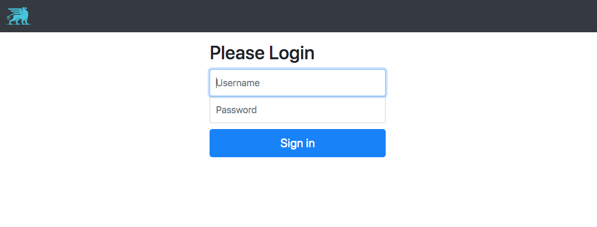
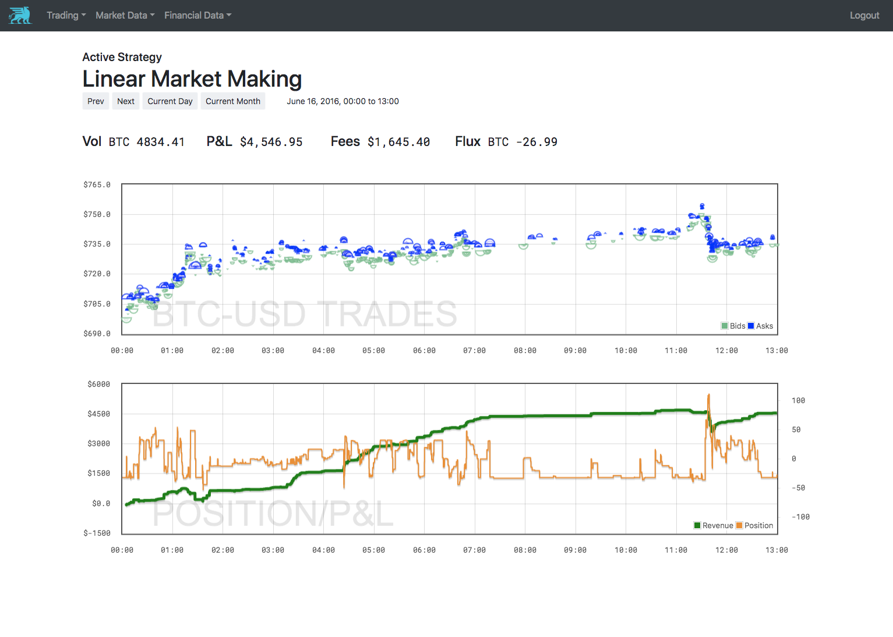
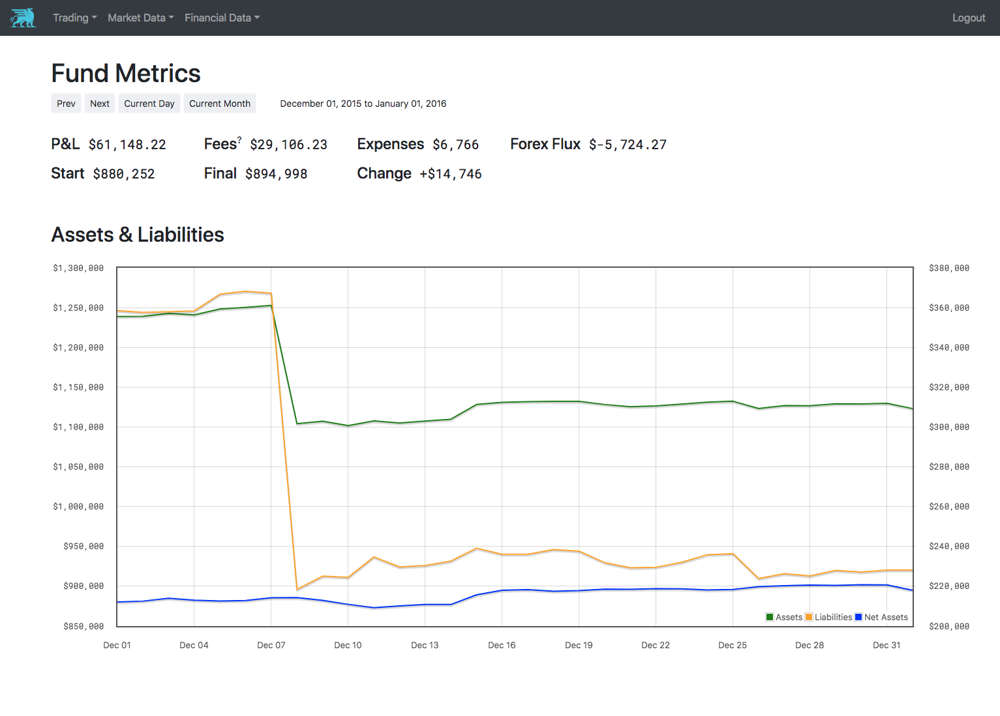
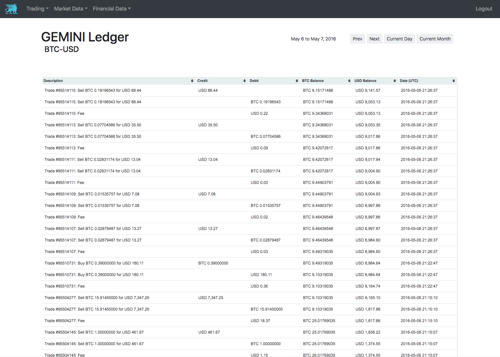

.. _dashboards:

================
Dashboard Server
================

Gryphon ships with a full suite of dashboards for managing your strategies and your
trading business. They exist in a webserver you can run locally or over the
internet so you can access them from anywhere.

.. _dashboard_installation:

Installation
============

.. _gryphon+dashboards.txt: https://github.com/TinkerWork/gryphon/blob/master/requirements/gryphon%2Bdashboards.txt

The dashboard server has some extra python requirements that the simple trading install
doesn't have. To install these, download the requirements file
`gryphon+dashboards.txt`_ from the gryphon github repository and run

.. code-block:: bash

    pip install -r gryphon+dashboards.txt

The dashboard service has it's own set of required environment variables, as well as it's own optional configuration file, so we recommend creating a subdirectory under your gryphon root dedicated to running the dashboard server from. Your gryphon directory might look something like this now.

.. code-block:: bash

    gryphon-root/
      dashboards/
        .env
        dashboards.conf
      strategies/
      .env

.. _dashboard_user_accounts:

User Accounts
-------------

The dashboard server has a simple user account management system built in. To set it up, create a new database, either on the same instance as your trading database or otherwise, and add the mysql url and credentials to it to your dashboard :code:`.env` file, under the key, :code:`DASHBOARD_DB_CRED`. Create a user with all read/write privileges to this database. By convention, we usually call this database simply 'dashboards' and the user 'dashboard_user'. If you follow these conventions, this credential will look something like this:

.. code-block:: bash

    DASHBOARD_DB_CRED="mysql://dashboard_user:[password]@[instance_url]:3306/dashboards?charset=utf8"

Similar to the trading database, it's necessary to set up the schema before we can do anything else with this database. Luckily we've built a shortcut to this into :code:`gryphon-exec`. You can run it with:

.. code-block:: bash

    gryphon-exec run-migrations dashboard --execute.

You can remove the :code:`--execute` flag to do a side-effect free dry run first if you like. Again, this must be run from the directory with your dashboard :code:`.env` file in it.

Finally, with the database set up and migrated, you can start adding user logins to the database. This is done again through a :code:`gryphon-exec` utility as follows:

.. code-block:: bash

    gryphon-exec create-dashboard-user --execute

This will take you through a short setup script, at the end of which you'll have added your first set of user credentials to the dashboard db.

Minimal .env
------------

You've already added your dashboard db credential to the :code:`.env`, but there are a few more needed. Here are the complete minimum contents of the file.

.. code-block:: bash

    APP_ENV=LOCAL
    APP_ROOT=dashboards
    APP_COOKIE_SECRET=[cookie secret]
    DASHBOARD_DB_CRED=[your dashboard db cred]
    TRADING_DB_CRED=[readonly credential to the trading database]

The first two are boilerplate that can just be directly copied from here.

.. _gist: https://gist.github.com/z0u/a74d6dd9a035bdd0745d

:code:`APP_COOKIE_SECRET` is a parameter required by Tornado, the webserver framework our dashboards are built in. This is a random secret that can be generated in a python console using the code shown in this github gist_.

Finally, you also need to add your trading database cred, that is, the database that holds the trading history for you strategies and the exchange ledgers. Most of the interesting functionality in the dashboards is visualizations of this so it doesn't make sense to run the server without it.

For security purposes, it is highly recommended that you create a new database login for the trading database with read-only privileges for this purpose. The dashboards should never need to write to that database so it's only asking for trouble if you give them that ability.

Running and accessing the dashboards
------------------------------------

With all this set-up complete, you can run your dashboard server with this command, from the directory with your dashboard :code:`.env`:

.. code-block:: bash

    gryphon-dashboards

Point your web browser at :code:`localhost:8080` and you should see this login screen:

Congratulations, you are running the gryphon dashboard server!

.. _dashboard_tour:

Tour
====

We'll take you through the most commonly used dashboard pages briefly.

.. _`ISO 8601`: https://en.wikipedia.org/wiki/ISO_8601

.. _dashboard_tour_strategy:

Strategy Dashboard
------------------

The strategy dashboard is intended to give an detailed description of the actions taken by a strategy in a given period. You can adjust the period under consideration with the time window toggles under the title, and if you want more fine-grained control you can edit the query string in your browser directly. You can specify time periods down to the second in the `ISO 8601`_ date format.

The trading graph shows all the filled orders placed by the strategy in the time-widow. Orders that were cancelled with no filled volume are not shown. Orders are shown as blue, upper semi-circles to denote asks, and green lower-semi-circles to denote bids. The surface area of a symbol is proportional to the filled volume. This display scheme was designed for market making strategies, which make their p&l from the distance between a bid-ask round trip. In this scheme, a similarly-sized bid and ask trade with a good gap between them shows a good profit, while a negative gap indicates the strategy got crossed and took a loss.

The second graph simply shows the strategy's position over time and realized p&l. It's usually simple to see a relationship between the trades in the top graph and the p&l effect in the bottom.

.. _dashboard_tour_fund:

Fund Dashboard
--------------

The fund dashboard gives you a quick overview of the performance of your business in a given time window. In particular it breaks down your performance into it's components: trading revenue, exchange fees, operating costs, liabilities, and foreign exchange fluctuations.

.. _dashboard_tour_ledger:

Ledger Dashboard
----------------

This dashboard allows for fine-grained debugging of the ledger. For a given exchange account it shows every ledger item, every fee, trade, transaction, and drift.

When a balance mismatch is found between our ledger and an exchange API, it's useful to isolate the time the mismatch was introduced and look at the exact ledger operations recorded in our database using this dashboard. Most exchanges offer a similar feature or a .csv export option, so you can compare line-by-line their records with what is in the trading database.

.. _dashboard_configuration:

Configuration
=============

The dashboard server ships loaded with strategy dashboards for the builtin strategies, but you can add extra strategy dashboards for your own proprietary strategies by adding a section to your :code:`dashboard.conf`. You identify the strategy by setting the parameter :code:`strategy_actor` to the correct value for your strategy (if your strategy hasn't overridden this, it's likely the class name uppercased). You can tweak the size of the symbols on the trading graph, the scaling of the position graph. Setting the price and volume currencies of the strategy is good practice.

.. code-block:: bash

    [strategies:simple_mm_ethusd]
    price_currency: USD
    volume_currency: ETH
    base_point_radius: 30
    graph_volume_threshold: 0.00001
    display_name: Simple Market Making ETHUSD
    strategy_actor: SIMPLEMARKETMAKINGETH
    position_graph_min: -0.05
    position_graph_max: 0.05

